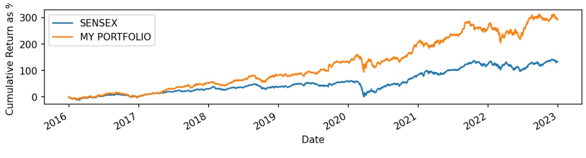

# Portfolio_Optimisation

In today's world, where the return on saving and old age plan schemes are negligible due to the high inflation rate, people choose a Mutual-Fund and Exchange-traded fund over a fixed deposit and public provident fund.
But over time, the fund manager's commission is increasing, leading to lower returns for the investor. 
So In this project, I choose four stocks from different sectors these are Asian Paints, Hindustan Unilever ICICI bank and bharti airtel from consumer discretionary, fast-moving consumer goods, financial services and telecom sectors, respectively. In this project, I will use **monte carlo simulation and a minimisation search of sciPY** to find a portfolio containing these stocks with the highest return and less volatility. So that investors can use this portfolio to gain capital while taking less risk

# Sectors Specific information is as follows:-

## Consumer Discretionary Sector

The sector includes businesses that sell non-essential goods, which consumers may avoid purchasing as it will not hamper their day-to-day living. This sector is more correlated with the growth of the nation as when the disposable income of consumers increases, and they tend to buy these products otherwise, then siphon this amount for their savings so that they can survive during the recession or other unfavourable circumstances.

## Fast-moving consumer goods

Consumer goods are those that the average consumer consumes, and fast-moving consumer goods sell quickly and at relatively low cost. They are also called consumer packaged goods.

## Financial Services

This sector is the primary driver of the nation's economy. In simple terms, these are institutions which move capital from people who are in surplus to the people or institutions who require money.

## Telecom Sector

The telecommunication sector consists of companies that make communication possible globally, whether through the phone, the internet, over airwaves, or cables. These companies create the infrastructure that allows data such as text, voice, audio, or video to be sent anywhere in the world. (source:-U.S. Bureau of labour statistics)

# My_Portfolio

